# Boas-vindas ao repositório do projeto TRYBNB

| 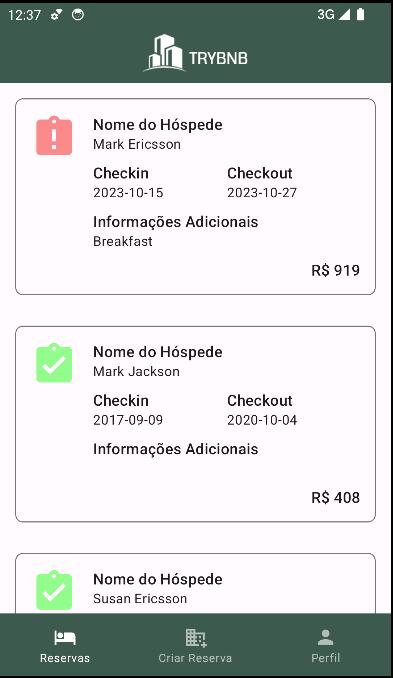 | 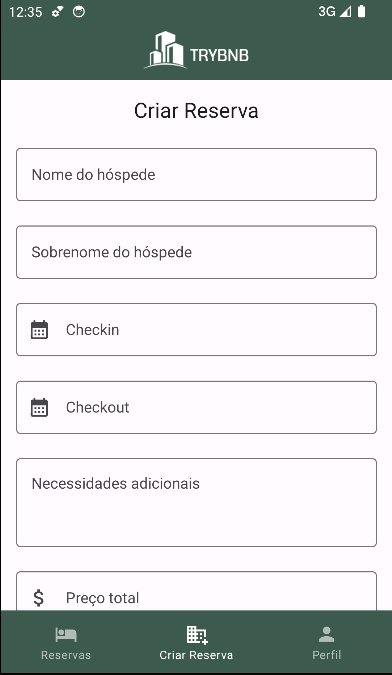 | 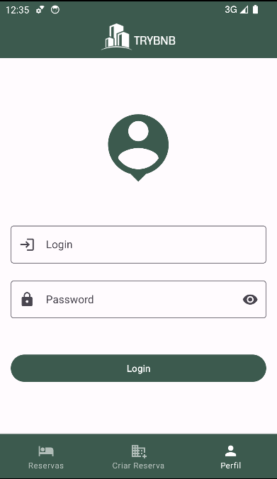 |
|:---:| :---: | :---: |

<br />

Para realizar o projeto, atente-se a cada passo descrito a seguir, e se tiver **qualquer dúvida**, nos envie no _Slack_ da turma! #vqv 🚀

Aqui, você vai encontrar os detalhes de como estruturar o desenvolvimento do seu projeto a partir desse repositório, utilizando uma branch específica e um _Pull Request_ para colocar seus códigos.

<br />

## Termos e acordos

Ao iniciar este projeto, você concorda com as diretrizes do [Código de Conduta e do Manual da Pessoa Estudante da Trybe](https://app.betrybe.com/learn/student-manual/codigo-de-conduta-da-pessoa-estudante).

<br />

## Entregáveis

<!-- <details><summary><strong>🤷🏽‍ Como entregar</strong></summary><br />

Para entregar o seu projeto, você deverá criar um _Pull Request_ neste repositório.

Lembre-se que você pode consultar nosso conteúdo sobre [Git & GitHub](https://app.betrybe.com/learn/course/5e938f69-6e32-43b3-9685-c936530fd326/module/f04cdb21-382e-4588-8950-3b1a29afd2dd/section/876a615b-f578-4d65-a820-de9f3e5e57db/lesson/be8632bf-7bb7-4c01-a5d9-7aadac3a58f0) sempre que precisar!
<br /></details> -->

<details><summary><strong>🧑‍💻 O que deverá ser desenvolvido</strong></summary><br />

Você é responsável por desenvolver um aplicativo Android para criar e exibir as reservas feitas pelos hóspedes, utilizando os dados da API [restful-booker](https://restful-booker.herokuapp.com/apidoc/index.html). Este aplicativo inclui o layout, a validação de estados dos componentes e o código de consumo de uma API Rest com Retrofit, seguindo a arquitetura MVVM.

<br /></details>

<details><summary><strong>📝 Habilidades a serem trabalhadas </strong></summary><br />

Neste projeto, verificaremos se você é capaz de:

- Dominar os conceitos fundamentais de Kotlin, como tipos de dados, estruturas de controle de fluxo, funções, lambdas, etc;
- Compreender a estrutura básica do Android SDK, componentes de UI (User Interface), e ciclo de vida de atividades e fragmentos;
- Trabalhar com Views, Layouts, e outros elementos da interface do usuário;
- Familiarizar-se com o padrão de arquitetura MVVM (Model-View-ViewModel) e implementá-lo eficientemente em seu aplicativo;
- Entender como fazer solicitações de rede usando Retrofit para consumir dados de uma API REST;
- Aplicar os princípios do Material Design para criar uma interface do usuário intuitiva e agradável;

<br /></details>

<details><summary><strong>🗓 Data de Entrega</strong></summary><br />

- Este projeto é individual;

- Serão `3` dias de projeto;

- Data para entrega final do projeto: `16/01/2024 14:00`.

<br /></details>

## Orientações

<details><summary><strong>🎛 Linter</strong></summary><br />

Usaremos o [Ktlint](https://pinterest.github.io/ktlint/) para fazer o lint do seu código.

Este projeto já vem com as dependências relacionadas ao _linter_ configuradas no arquivo `build.gradle`.

Para poder rodar o `Ktlint` de forma local, rode o comando de acordo com o sistema operacional:

Mac ou Linux:
```bash
./gradlew ktlintCheck
```

Windows:
```bash
gradlew ktlintCheck
```

Se a análise do `Ktlint` encontrar problemas no seu código, tais problemas serão mostrados no seu terminal.

<br /></details>

<details><summary><strong>👀 Analisador estático de código</strong></summary><br />

Usaremos o [Detekt](https://detekt.dev/) para fazer a análise estática do seu código.

Este projeto já vem com as dependências relacionadas ao _linter_ configuradas no arquivo `build.gradle`.

Para poder rodar o `Detekt` de forma local, rode o comando de acordo com o sistema operacional:

Mac ou Linux:
```bash
./gradlew detekt
```

Windows:
```bash
gradlew detekt
```

Se a análise do `Ktlint` encontrar problemas no seu código, tais problemas serão mostrados no seu terminal.
<br /></details>

<details><summary><strong>🛠 Testes</strong></summary><br />

Todos os requisitos do projeto serão testados automaticamente por meio do `Espresso`, uma ferramenta que testa interfaces. Você pode rodar o teste instrumentado no Android Studio ou via linha de comando.

#### Linha de comando

- Abra o emulador

- Execute o comando para os testes de Instrumentação
  - Mac ou Linux: `./gradlew connectedAndroidTest`
  - Windows: `gradlew connectedAndroidTest`

- Execute o comando para os testes Unitários
  - Mac ou Linux: `./gradlew testDebugUnitTest`
  - Windows: `gradlew testDebugUnitTest`

#### Android Studio

- Encontre a Seção de Testes:

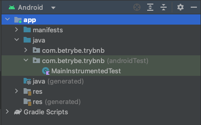

- Abra o arquivo de teste `MainInstrumentedTest`

##### Executando todos os teste

- Para executar todos os testes, basta clicar no ícone de reprodução verde duplo:

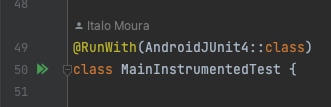

- Em seguida, clique em `RunMainInstrumentedTest...`

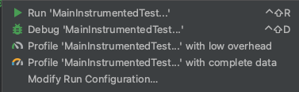

##### Executando um teste específico

- Para executar um teste específico, basta clicar no ícone de reprodução ao lado de cada teste de requisito:

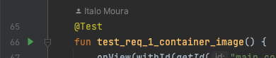

- Em seguida, clique em `test_req_01_container...`

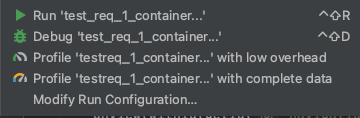

#### Avaliação

Os requisitos do seu projeto são avaliados automaticamente. Para verificar se a sua avaliação foi computada com sucesso, você pode verificar os **detalhes da execução do avaliador**:

- Na página do seu _Pull Request_, acima do "botão de merge", procure por `Evaluator job` e clique no link `Details`;

- Na página que se abrirá, procure pela linha `Evaluator step` e clique nela;

- Caso tenha dúvidas, peça ajuda no _Slack_.

⚠️ **O avaliador automático não necessariamente avalia seu projeto na ordem em que os requisitos aparecem no README. Isso acontece para deixar o processo de avaliação mais rápido. Então, não se assuste se isso acontecer, ok?**

O não cumprimento de um requisito, total ou parcialmente, impactará em sua avaliação.
<br /></details>

<details><summary><strong>✅ Avaliador Remoto</strong></summary> <br />

Para o avaliador remoto, estamos utilizando um dispositivo virtual com as seguintes configurações:

- API level: 29
- Display: 320x640
- DPI: 160x160
- Disable animations: true
- Disable spellchecker: false
- Disable Linux hardware acceleration: false
- Enable hardware keyboard: false

O projeto foi configurado para ser executado com versões específicas. Pode ocorrer que, ao baixar o projeto, o Android Studio sugira a atualização com a seguinte pergunta:


⚠️ Não atualize o projeto, pois pode não ser compatível com o avaliador remoto. ⚠️

<br /></details>

<details><summary><strong>🏗 Estrutura do projeto</strong></summary> <br />

O seu Pull Request deverá conter, obrigatoriamente, os arquivos `MainActivity.kt`, `ApiIdlingResource` e `activity_main.xml`.

As imagens pedidas no projeto estão dentro da pasta _/res_.

⚠️ É importante que seus arquivos tenham exatamente estes nomes!

Caso sinta a necessidade de adicionar outros arquivos além destes, sinta-se à vontade.

<strong>API BACKEND</strong><br />

Neste projeto, estaremos utilizando a API chamada [Restful-booker](https://restful-booker.herokuapp.com/apidoc/index.html).

<br /></details>

# Requisitos do projeto

## `1 - Configure a estrutura inicial da tela incluindo a barra superior com o logotipo`

O aplicativo apresentará seu conteúdo principal em um contêiner principal. Dentro desse contêiner principal, teremos outro contêiner que servirá como o topo, e dentro dele, centralizaremos nosso logotipo.

<details><summary><strong>️📱 Tela</strong></summary><br />


<br /></details>

<details><summary><strong>👩‍💻 Regras de implementação</strong></summary>

### Onde desenvolver

- O arquivo que você implementará o layout deve se chamar `activity_main.xml` e deve estar dentro do diretório `src/res/layout`;

### Estrutura da árvore de componentes da tela

```
App
└── LinearLayout
    └── ConstraintLayout
        └── ImageView
```

### Regras de negócio

#### LinearLayout

- **Configuração**
  - Deve ser o elemento raíz da tela
  - Deve ter o id `main_container`
- **Layout**
  - Largura e altura devem ser a mesma do elemento pai
  - Orientação deve ser `vertical`

#### ConstraintLayout

- **Configuração**
  - Deve ser elemento filho do LinearLayout
  - Deve ter o id `navigation_bar_container`
- **Layout**
  - Largura deve ser a mesma do elemento pai
  - Altura devem estar definida em `60dp`
  - Deve ter uma cor de fundo definida como `@color/navigation`

#### ImageView

- **Configuração**
  - Deve ser elemento filho do ConstraintLayout
  - Deve ter o id `logo_main_activity`
- **Layout**
  - Largura deve ser a mesma do elemento pai
  - Altura deve envolver o conteúdo
  - Preenchimento de corte deve estar habilitado
- **Constraints**:
  - A constraint `top` deve ser ancorada no `top` do elemento pai
  - A constraint `bottom` deve ser ancorada no `bottom` do elemento pai
  - A constraint `right` deve ser ancorada no `right` do elemento pai
  - A constraint `left` deve ser ancorada no `left` do elemento pai
- **Atributos**
  - A imagem usada deve ser `@drawable/logo`

### O que será testado?

- `LinearLayout`
  - O elemento `LinearLayout` está visível
  - O elemento `LinearLayout` é do tipo LinearLayout
  - O elemento `LinearLayout` possui o id main_container
- `ConstraintLayout`
  - O elemento `ConstraintLayout` está visível
  - O elemento `ConstraintLayout` é filho do elemento LinearLayout
  - O elemento `ConstraintLayout` possui o id navigation_bar_container
- `ImageView`
  - O elemento `ImageView` está visível
  - O elemento `ImageView` é filho do elemento ConstraintLayout
  - O elemento `ImageView` possui o id logo_main_activity

<br/></details>

## `2 - Configure a estrutura da tela inicial adicionando uma barra de navegação na parte inferior e um fragment container`

O aplicativo exibirá em seu conteúdo principal uma BottomNavigation com três itens e um fragmentContainer, ambos sendo filhos do LinearLayout principal.

<details><summary><strong>️📱 Tela</strong></summary><br />

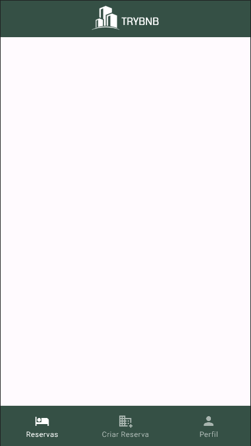

<br /></details>

<details><summary><strong>👩‍💻 Regras de implementação</strong></summary>

### Onde desenvolver

- O arquivo que você implementará o layout deve se chamar `activity_main.xml` e deve estar dentro do diretório `src/res/layout`;

### Estrutura da árvore de componentes da tela

```
App
└── LinearLayout
    └── ConstraintLayout
        └── ImageView
    └── FragmentContainerView
    └── BottomNavigationView
```

### Regras de negócio

#### FragmentContainerView

- **Configuração**
  - Deve ter o id `main_fragment_container`
  - Deve ser elemento filho do LinearLayout
- **Layout**
  - Largura deve ser a mesma do elemento pai
  - Altura deve ser `0dp`
  - O peso deve ser `1`
  - Orientação deve ser `vertical`

#### BottomNavigationView

- **Configuração**
  - Deve ser elemento filho do LinearLayout
  - Deve ter o id `navigation_bottom_view`
- **Layout**
  - Largura deve ser a mesma do elemento pai
  - Altura deve envolver o conteudo
  - Deve possuir um espaçamento no topo e na parte inferior de `5dp`
  - Modo de visibilidade este ser `labeled`
- **Atributos**
  - O menu deve apontar para um xml chamado `bottom_navigation_menu.xml` (Você deve criar esse menu na pasta `res/menu`)
- **Menu**
  - O primeiro item deve ter:
    - O título com `Reservas`
    - Um icone chamado `ic_reservation`
  - O segundo item deve ter:
    - O título com `Criar Reservas`
    - Um icone chamado `ic_create_reservation`
  - O terceiro item deve ter:
    - O título com `Perfil`
    - Um icone chamado `ic_profile`

### O que será testado?

- `FragmentContainerView`
  - O elemento `FragmentContainerView` está visível
  - O elemento `FragmentContainerView` é do tipo FragmentContainerView
  - O elemento `FragmentContainerView` é filho do elemento LinearLayout
  - O elemento `FragmentContainerView` possui o id main_fragment_container
- `BottomNavigationView`
  - O elemento `BottomNavigationView` está visível
  - O elemento `BottomNavigationView` é do tipo BottomNavigationView
  - O elemento `BottomNavigationView` é filho do elemento LinearLayout
  - O elemento `BottomNavigationView` possui o id navigation_bottom_view

<br/></details>

## `3 - Implemente a navegação do BottomNavigation de forma que, ao clicar em cada item do menu, seja chamado o respectivo fragmento`

Ao clicar em cada item do BottomNavigation, deve-se abrir o respectivo fragmento no FragmentContainerView. Cada fragmento deve ter em seu layout um container root com seus respectivos IDs.

<details><summary><strong>👩‍💻 Regras de implementação</strong></summary>

### Onde desenvolver

- Voce vai precisar criar tres fragmentos chamados:
  - ReservationFragment
  - CreateReservationFragment
  - ProfileFragment

- Cada fragmento deve gerar seus respectivos arquvios de layout:
  - fragment_reservation.xml
  - fragment_create_reservation.xml
  - fragment_profile.xml

### Estrutura da árvore de componentes da tela

#### Estrutura do Fragmento Reservas

```
App
└── FrameLayout
```

#### Estrutura do Fragmento Criar Reservas

```
App
└── ScrollView
```

#### Estrutura do Fragmento Perfil

```
App
└── ScrollView
```

### Regras de negócio

#### FrameLayout

- **Configuração**
  - Deve ter o id `reservation_frame_layout`
  - Deve ser elemento o elemento root
- **Layout**
  - Largura e Altura devem ser a mesma do elemento pai

#### ScrollView do fragmento Criar Reservas

- **Configuração**
  - Deve ter o id `create_reservation_scroll_view`
  - Deve ser elemento o elemento root
- **Layout**
  - Largura e Altura devem ser a mesma do elemento pai
  - Deve possuir a barra de rolagem `Oculta`

#### ScrollView do fragmento Perfil

- **Configuração**
  - Deve ter o id `profile_scroll_view`
  - Deve ser elemento o elemento root
- **Layout**
  - Largura e Altura devem ser a mesma do elemento pai
  - Deve possuir a barra de rolagem `Oculta`

### O que será testado?

- Ao clicar no item do menu `Reservas` o fragmento de reservas deve ser carregado com o container root com id `reservation_frame_layout`
- Ao clicar no item do menu `Criar Reservas` o fragmento de reservas deve ser carregado com o container root com id  `create_reservation_scroll_view`
- Ao clicar no item do menu `Perfil` o fragmento de reservas deve ser carregado com o container root com id `profile_scroll_view`

<br/></details>

## `4 - Crie a estrutura do fragmento Perfil`

O aplicativo exibirá em seu conteúdo uma imagem, dois campos de entrada e um botão de acesso.

<details><summary><strong>️📱 Tela</strong></summary><br />

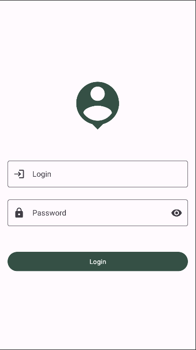

<br /></details>

<details><summary><strong>👩‍💻 Regras de implementação</strong></summary>

### Onde desenvolver

- O arquivo que você implementará o layout deve se chamar `fragment_profile.xml` e deve estar dentro do diretório `src/res/layout`;

### Estrutura da árvore de componentes da tela

```
App
└── ScrollView
    └── LinearLayout
        └── ImageView
        └── TextInputLayout
            └── TextInputEditText
        └── TextInputLayout
            └── TextInputEditText
        └── Button
```

### Regras de negócio

#### LinearLayout

- **Configuração**
  - Deve ter o id `profile_container`
  - Deve ser elemento filho do ScrollView
- **Layout**
  - Largura deve ser a mesma do elemento pai
  - Altura deve envolver o conteúdo
  - Orientação deve ser `vertical`
  - Margem de `16dp`
  - Gravidade do layout `Centralizado`

#### ImageView

- **Configuração**
  - Deve ser elemento filho do LinearLayout
  - Deve ter o id `person_image_profile`
- **Layout**
  - Largura e Altura definidas em `120dp`
  - Margem inferior definida em `50dp`
  - Gravidade do layout `Centralizado na Horizontal`
- **Atributos**
  - Sua imagem deve ser `ic_person`

#### TextInputLayout

- **Configuração**
  - Deve ser elemento filho do LinearLayout
  - Deve ter o id `login_input_profile`
- **Layout**
  - Largura deve ser a mesma do elemento pai
  - Altura deve envolver o conteúdo
  - Margem inferior definida em `20dp`
- **Atributos**
  - O campo deve ter um ícone de início `ic_login`
  - A label do campo deve ser `Login`

#### TextInputLayout

- **Configuração**
  - Deve ser elemento filho do LinearLayout
  - Deve ter o id `password_input_profile`
- **Layout**
  - Largura deve ser a mesma do elemento pai
  - Altura deve envolver o conteúdo
  - Margem inferior definida em `50dp`
- **Atributos**
  - O campo deve ter um ícone de início `ic_password`
  - O campo deve ter um modo de ícone de final `password_toggle`
  - A label do campo deve ser `Password`

#### Button

- **Configuração**
  - Deve ser elemento filho do LinearLayout
  - Deve ter o id `login_button_profile`
- **Layout**
  - Largura deve ser a mesma do elemento pai
  - Altura deve envolver o conteúdo
- **Atributos**
  - O texto do botão deve ser `Login`

### O que será testado?

- `ScrollView`
  - O elemento `ScrollView` está visível
  - O elemento `ScrollView` possui o id profile_scroll_view
- `LinearLayout`
  - O elemento `LinearLayout` está visível
  - O elemento `LinearLayout` é do tipo LinearLayout
  - O elemento `LinearLayout` é filho do elemento ScrollView
  - O elemento `LinearLayout` possui o id profile_container
- `ImageView`
  - O elemento `ImageView` está visível
  - O elemento `ImageView` é do tipo ImageView
  - O elemento `ImageView` é filho do elemento LinearLayout
  - O elemento `ImageView` possui o id person_image_profile
- `TextInputLayout`
  - O elemento `TextInputLayout` está visível
  - O elemento `TextInputLayout` é do tipo TextInputLayout
  - O elemento `TextInputLayout` é filho do elemento LinearLayout
  - O elemento `TextInputLayout` possui o id login_input_profile
- `TextInputLayout`
  - O elemento `TextInputLayout` está visível
  - O elemento `TextInputLayout` é do tipo TextInputLayout
  - O elemento `TextInputLayout` é filho do elemento LinearLayout
  - O elemento `TextInputLayout` possui o id password_input_profile
- `Button`
  - O elemento `Button` está visível
  - O elemento `Button` é do tipo Button
  - O elemento `Button` é filho do elemento LinearLayout
  - O elemento `Button` possui o id login_button_profile

<br/></details>

## `5 - Implemente a validação do campo Login e Password`

As pessoas podem inserir qualquer valor nos campos de login e senha. Considerando isso, vamos implementar a validação no aplicativo! Se o campo de login ou senha estiver vazio, será exibida uma mensagem de erro.

<details><summary><strong>️📱 Tela</strong></summary><br />

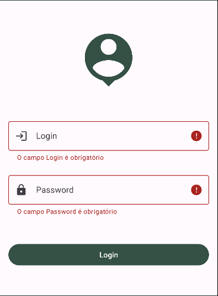

<br /></details>

<details><summary><strong>👩‍💻 Regras de implementação</strong></summary>

### Regras de negócio

- Se o campo de login estiver vazio, ele deve exibir a mensagem de erro com o texto `O campo Login é obrigatório`
- Se o campo de senha estiver vazio, ele deve exibir a mensagem de erro com o texto `O campo Password é obrigatório`
- A validação será realizada após o clique no botão Login.

### O que será testado?

- Que ao clicar no menu Perfil, o fragmento do perfil será carregado
- Que os campos de Login e Password são deixados em branco, eles devem exibir suas respectivas mensagens de erro

<br/></details>

## `6 - Realizar requisição ao endpoint POST /auth via Retrofit`

Para realizar a autenticação da [API](https://restful-booker.herokuapp.com/apidoc/index.html#api-Auth), é necessário criar uma interface com a assinatura do método que representa o endpoint POST /auth e a anotação necessária para utilizar juntamente com o Retrofit.

<details><summary><strong>👩‍💻 Regras de implementação</strong></summary>

### Regras de implementação

O objetivo deste requisito é implementar ou criar uma interface para realizar requisições à API, utilizando-a em conjunto com o Retrofit.

Para que este requisito funcione corretamente, você precisará usar a classe `ApildlingResource` dentro de todas as suas Coroutines, como no exemplo a seguir:

``` Kotlin
CoroutineScope(Main).launch {
    try {
        // ADICIONAR ESSA LINHA
        ApiIdlingResource.increment()

        //...
        // Seu Codigo das Rotinas
        // ...

        // ADICIONAR ESSA LINHA
        ApiIdlingResource.decrement()
    } catch (e: HttpException) {
        // ADICIONAR ESSA LINHA
        ApiIdlingResource.decrement()

        //...
        // Seu Codigo de erro de HttpException
        // ...
    } catch (e: IOException) {
        // ADICIONAR ESSA LINHA
        ApiIdlingResource.decrement()

        //...
        // Seu Codigo de erro de IOException
        // ...
    }
}
```

### O que será testado?

- Ao clicar no menu `Perfil``, o fragmento do perfil será carregado
- Será digitado o login `admin` com a senha `password123`
- A requisição será realizada ao clicar no botão Login
- Após uma requisição bem-sucedida, a mensagem `Login feito com sucesso!` aparecerá na tela

<br/></details>

## `7 - Crie a estrutura do layout do fragmento Reservas`

O aplicativo exibirá em seu conteúdo uma lista de reservas usando o componente `RecyclerView`.

<details><summary><strong>👩‍💻 Regras de implementação</strong></summary>

### Onde desenvolver

- O arquivo que você implementará o layout deve se chamar `fragment_reservation.xml` e deve estar dentro do diretório `src/res/layout`;

### Estrutura da árvore de componentes da tela

``` Text
App
└── FrameLayout
    └── RecyclerView
```

### Regras de negócio

#### RecyclerView

- **Configuração**
  - Deve ter o id `reservation_recycler_view`
  - Deve ser elemento filho do FrameLayout
- **Layout**
  - Largura e Altura devem ser a mesma do elemento pai

### O que será testado?

- `FrameLayout`
  - O elemento `FrameLayout` está visível
  - O elemento `FrameLayout` possui o id reservation_frame_layout
- `RecyclerView`
  - O elemento `RecyclerView` está visível
  - O elemento `LinearLayout` é do tipo RecyclerView
  - O elemento `LinearLayout` é filho do elemento FrameLayout
  - O elemento `RecyclerView` possui o id reservation_frame_layout

<br/></details>

## `8 - Desenvolva o layout do item e popule a lista com as informações provenientes da API`

Você deverá criar o arquivo de layout para o item da lista, e as informações dessa lista virão das seguintes rotas da API:
- GET /booking
- GET /booking/:id

⚠️ A rota /booking é responsável por fornecer todos os IDs das reservas. Utilizando o ID, é necessário consultar a rota /booking/:id para obter as informações específicas. Ao lidar com essa lista, recomendo filtrar pelos cinco primeiros IDs ao buscar, evitando consultas extensas que podem resultar em timeouts e prejudicar o teste. ⚠️

<details><summary><strong>️📱 Tela</strong></summary><br />


<br /></details>

<details><summary><strong>👩‍💻 Regras de implementação</strong></summary>

### Onde desenvolver

- O arquivo que você implementará o layout deve se chamar `list_item_reservation.xml` e deve estar dentro do diretório `src/res/layout`
- Não esqueça de atribuir o layout do item à propriedade `listitem` no `RecyclerView` do arquivo `fragment_reservation.xml`

### Estrutura da árvore de componentes da tela

``` Text
App
└── MaterialCardView
    └── LinearLayout
        └── ImageView
        └── LinearLayout
            └── TextView
            └── TextView
            └── LinearLayout
                └── TextView
                └── TextView
            └── LinearLayout
                └── TextView
                └── TextView
            └── TextView
            └── TextView
            └── LinearLayout
                └── TextView
                └── TextView
```

### Regras de negócio

#### MaterialCardView

- **Configuração**
  - Deve ter o id `card_view_item_reservation`
  - Deve ser o elemento root do layout
- **Layout**
  - Largura deve ser a mesma do elemento pai
  - Altura deve envolver o conteúdo
  - O item não pode ser clicável
  - Uma margem definida com `16dp`
  - Orientação deve ser `vertical`

#### LinearLayout

- **Configuração**
  - Deve ser filho do elemento MaterialCardView
- **Layout**
  - Largura e Altura devem ser a mesma do elemento pai
  - O item não pode ser clicável
  - Deve possuir um espaçamento de `16dp`
  - Orientação deve ser `horizontal`

#### ImageView

- **Configuração**
  - Deve ter o id `depositpaid_item_reservation`
  - Deve ser filho do elemento LinearLayout
- **Layout**
  - Largura e Altura devem ser definidas em `50dp`
  - Deve possuir uma margem final de `16dp`
- **Atributos**
  - A imagem padrão deve ser `ic_depositpaid_false`

#### LinearLayout

- **Configuração**
  - Deve ser filho do elemento LinearLayout
- **Layout**
  - Largura deve ser a mesma do elemento pai
  - Altura deve envolver o conteúdo
  - Orientação deve ser `Vertical`

#### TextView

- **Configuração**
  - Deve ser filho do elemento LinearLayout
- **Layout**
  - Largura e Altura devem envolver o conteúdo
  - Aparencia do texto deve ser `TitleMedium`
- **Atributos**
  - O texto padrão deve ser `Nome do Hóspede`

#### TextView

- **Configuração**
  - Deve ter o id `name_item_reservation`
  - Deve ser filho do elemento LinearLayout
- **Layout**
  - Largura e Altura devem envolver o conteúdo
  - Aparencia do texto deve ser `BodyMedium`
  - Margim de baixo com `10dp`

#### LinearLayout

- **Configuração**
  - Deve ser filho do elemento LinearLayout
- **Layout**
  - Largura deve ser a mesma do elemento pai
  - Altura deve envolver o conteúdo
  - Orientação deve ser `horizontal`

#### TextView

- **Configuração**
  - Deve ser filho do elemento LinearLayout
- **Layout**
  - Largura deve ser a mesma do elemento pai
  - Altura deve envolver o conteúdo
  - Deve possuir um peso de `1`
  - Aparencia do texto deve ser `TitleMedium`
- **Atributos**
  - O texto padrão deve ser `Checkin`

#### TextView

- **Configuração**
  - Deve ser filho do elemento LinearLayout
- **Layout**
  - Largura deve ser a mesma do elemento pai
  - Altura deve envolver o conteúdo
  - Deve possuir um peso de `1`
  - Aparencia do texto deve ser `TitleMedium`
- **Atributos**
  - O texto padrão deve ser `Checkin`

#### LinearLayout

- **Configuração**
  - Deve ser filho do elemento LinearLayout
- **Layout**
  - Largura deve ser a mesma do elemento pai
  - Altura deve envolver o conteúdo
  - Margem inferior de `10dp`
  - Orientação deve ser `horizontal`

#### TextView

- **Configuração**
  - Deve ter o id `checkin_item_reservation`
  - Deve ser filho do elemento LinearLayout
- **Layout**
  - Largura deve ser a mesma do elemento pai
  - Altura deve envolver o conteúdo
  - Deve possuir um peso de `1`
  - Aparencia do texto deve ser `BodyMedium`

#### TextView

- **Configuração**
  - Deve ter o id `checkout_item_reservation`
  - Deve ser filho do elemento LinearLayout
- **Layout**
  - Largura deve ser a mesma do elemento pai
  - Altura deve envolver o conteúdo
  - Deve possuir um peso de `1`
  - Aparencia do texto deve ser `BodyMedium`

#### TextView

- **Configuração**
  - Deve ser filho do elemento LinearLayout
- **Layout**
  - Largura e Altura devem envolver o conteúdo
  - Aparencia do texto deve ser `TitleMedium`
- **Atributos**
  - O texto padrão deve ser `Informações Adicionais`

#### TextView

- **Configuração**
  - Deve ter o id `additional_needs_item_reservation`
  - Deve ser filho do elemento LinearLayout
- **Layout**
  - Largura e Altura devem envolver o conteúdo
  - Margem inferior de `10dp`
  - Aparencia do texto deve ser `BodyMedium`

#### LinearLayout

- **Configuração**
  - Deve ser filho do elemento LinearLayout
- **Layout**
  - Largura e Altura devem envolver o conteúdo
  - Posicionamento do layout como `end`
  - Orientação deve ser `horizontal`

#### TextView

- **Configuração**
  - Deve ser filho do elemento LinearLayout
- **Layout**
  - Largura e Altura devem envolver o conteúdo
  - Aparencia do texto deve ser `TitleMedium`
- **Atributos**
  - O texto padrão deve ser `R$ `

#### TextView

- **Configuração**
  - Deve ter o id `total_price_item_reservation`
  - Deve ser filho do elemento LinearLayout
- **Layout**
  - Largura e Altura devem envolver o conteúdo
  - Aparencia do texto deve ser `TitleMedium`

### O que será testado?

- Ao clicar no menu `Reservas`, o fragmento de reservas será carregado
- `RecyclerView`
  - O elemento `RecyclerView` está visível
  - O elemento `RecyclerView` possui o id reservation_frame_layout
- `MaterialCardView`
  - O elemento `MaterialCardView` está visível
  - O elemento `MaterialCardView` possui o id card_view_item_reservation
- `ImageView`
  - O elemento `ImageView` está visível
  - O elemento `ImageView` possui o id depositpaid_item_reservation
- `TextView`
  - O elemento `TextView` está visível
  - O elemento `TextView` possui o id name_item_reservation
- `TextView`
  - O elemento `TextView` está visível
  - O elemento `TextView` possui o id checkin_item_reservation
- `TextView`
  - O elemento `TextView` está visível
  - O elemento `TextView` possui o id checkout_item_reservation
- `TextView`
  - O elemento `TextView` está visível
  - O elemento `TextView` possui o id additional_needs_item_reservation
- `TextView`
  - O elemento `TextView` está visível
  - O elemento `TextView` possui o id total_price_item_reservation

<br/></details>

## `9 - Desenvolva o layout da tela Criar uma Reserva`

Você deverá implementar o layout da tela de criação de reserva. Esse layout está construído com um contêiner principal, um ScrollView, e os demais componentes como filhos deste.

<details><summary><strong>️📱 Tela</strong></summary><br />

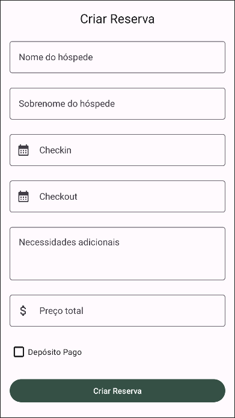

<br /></details>

<details><summary><strong>👩‍💻 Regras de implementação</strong></summary>

### Onde desenvolver

- O arquivo que você implementará o layout deve se chamar `fragment_create_reservation.xml` e deve estar dentro do diretório `src/res/layout`

### Estrutura da árvore de componentes da tela

``` Text
App
└── ScrollView
    └── LinearLayout
        └── MaterialTextView
        └── TextInputLayout
            └── TextInputEditText
        └── TextInputLayout
            └── TextInputEditText
        └── TextInputLayout
            └── TextInputEditText
        └── TextInputLayout
            └── TextInputEditText
        └── TextInputLayout
            └── TextInputEditText
        └── TextInputLayout
            └── TextInputEditText
        └── CheckBox
        └── MaterialButton
```

### Regras de negócio

#### ScrollView

- **Configuração**
  - Deve ter o id `create_reservation_scroll_view`
  - Deve ser o elemento root do layout
- **Layout**
  - Largura e Altura devem ser a mesma do elemento pai
  - Barra de rolagem deve estar oculta

#### LinearLayout

- **Configuração**
  - Deve ser filho do elemento LinearLayout
- **Layout**
  - Largura deve ser a mesma do elemento pai
  - Altura deve envolver o conteúdo
  - Margem definida em `16dp`
  - Orientação deve ser `Vertical`
  
#### MaterialTextView

- **Configuração**
  - Deve ter o id `title_create_reservationd`
  - Deve ser filho do elemento LinearLayout
- **Layout**
  - Largura deve ser a mesma do elemento pai
  - Altura deve envolver o conteúdo
  - Margem inferior de `20dp`
  - Aparencia do texto deve ser `TitleLarge`
  - O texto deve ser alinhado ao centro
- **Atributos**
  - O texto padrão deve ser `Criar Reserva`

#### TextInputLayout

- **Configuração**
  - Deve ter o id `first_name_create_reservation`
  - Deve ser filho do elemento LinearLayout
- **Layout**
  - Largura deve ser a mesma do elemento pai
  - Altura deve envolver o conteúdo
  - Margem inferior de `20dp`
- **Atributos**
  - O label do input deve ser `Nome do hóspede`

#### TextInputEditText

- **Configuração**
  - Deve ser filho do elemento TextInputLayout
- **Layout**
  - Largura deve ser a mesma do elemento pai
  - Altura deve envolver o conteúdo

#### TextInputLayout

- **Configuração**
  - Deve ter o id `last_name_create_reservation`
  - Deve ser filho do elemento LinearLayout
- **Layout**
  - Largura deve ser a mesma do elemento pai
  - Altura deve envolver o conteúdo
  - Margem inferior de `20dp`
- **Atributos**
  - O label do input deve ser `Sobrenome do hóspede`

#### TextInputEditText

- **Configuração**
  - Deve ser filho do elemento TextInputLayout
- **Layout**
  - Largura deve ser a mesma do elemento pai
  - Altura deve envolver o conteúdo

#### TextInputLayout

- **Configuração**
  - Deve ter o id `checkin_create_reservation`
  - Deve ser filho do elemento LinearLayout
- **Layout**
  - Largura deve ser a mesma do elemento pai
  - Altura deve envolver o conteúdo
  - Margem inferior de `20dp`
  - O icone do inicio deve ser `ic_calendar`
- **Atributos**
  - O label do input deve ser `Checkin`

#### TextInputEditText

- **Configuração**
  - Deve ser filho do elemento TextInputLayout
- **Layout**
  - Largura deve ser a mesma do elemento pai
  - Altura deve envolver o conteúdo

#### TextInputLayout

- **Configuração**
  - Deve ter o id `checkout_create_reservation`
  - Deve ser filho do elemento LinearLayout
- **Layout**
  - Largura deve ser a mesma do elemento pai
  - Altura deve envolver o conteúdo
  - Margem inferior de `20dp`
  - O icone do inicio deve ser `ic_calendar`
- **Atributos**
  - O label do input deve ser `Checkout`

#### TextInputEditText

- **Configuração**
  - Deve ser filho do elemento TextInputLayout
- **Layout**
  - Largura deve ser a mesma do elemento pai
  - Altura deve envolver o conteúdo

#### TextInputLayout

- **Configuração**
  - Deve ter o id `additional_needs_create_reservation`
  - Deve ser filho do elemento LinearLayout
- **Layout**
  - Largura deve ser a mesma do elemento pai
  - Altura deve envolver o conteúdo
  - Margem inferior de `20dp`
- **Atributos**
  - O label do input deve ser `Necessidades adicionais`

#### TextInputEditText

- **Configuração**
  - Deve ser filho do elemento TextInputLayout
- **Layout**
  - Largura deve ser a mesma do elemento pai
  - Altura deve envolver o conteúdo
  - Gravidade do layout ao início
  - Gravidade no topo e no início
  - Maximo de linhas `3`
  - Tipo do input `textMultiline`

#### TextInputLayout

- **Configuração**
  - Deve ter o id `total_price_create_reservation`
  - Deve ser filho do elemento LinearLayout
- **Layout**
  - Largura deve ser a mesma do elemento pai
  - Altura deve envolver o conteúdo
  - O icone do inicio deve ser `ic_money`
  - Margem inferior de `20dp`
- **Atributos**
  - O label do input deve ser `Preço total`

#### TextInputEditText

- **Configuração**
  - Deve ser filho do elemento TextInputLayout
- **Layout**
  - Largura deve ser a mesma do elemento pai
  - Altura deve envolver o conteúdo

#### CheckBox

- **Configuração**
  - Deve ter o id `depositpaid_create_reservation`
  - Deve ser filho do elemento LinearLayout
- **Layout**
  - Largura deve ser a mesma do elemento pai
  - Altura deve envolver o conteúdo
  - Margem inferior de `20dp`
- **Atributos**
  - O texto deve ser `Depósito Pago`

#### MaterialButton

- **Configuração**
  - Deve ter o id `create_reservation_button`
  - Deve ser filho do elemento LinearLayout
- **Layout**
  - Largura deve ser a mesma do elemento pai
  - Altura deve envolver o conteúdo
  - Margem inferior de `20dp`
- **Atributos**
  - O texto deve ser `Criar Reserva`

### O que será testado?

- Ao clicar no menu `Criar Reserva`, o fragmento de reservas será carregado
- `ScrollView`
  - O elemento `ScrollView` está visível
  - O elemento `ScrollView` possui o id create_reservation_scroll_view
- `MaterialTextView`
  - O elemento `MaterialTextView` está visível
  - O elemento `MaterialTextView` é do tipo MaterialTextView
  - O elemento `MaterialTextView` possui o id title_create_reservation
- `TextInputLayout`
  - O elemento `TextInputLayout` está visível
  - O elemento `TextInputLayout` é do tipo TextInputLayout
  - O elemento `TextInputLayout` possui o id first_name_create_reservation
- `TextInputLayout`
  - O elemento `TextInputLayout` está visível
  - O elemento `TextInputLayout` é do tipo TextInputLayout
  - O elemento `TextInputLayout` possui o id last_name_create_reservation
- `TextInputLayout`
  - O elemento `TextInputLayout` está visível
  - O elemento `TextInputLayout` é do tipo TextInputLayout
  - O elemento `TextInputLayout` possui o id checkin_create_reservation
- `TextInputLayout`
  - O elemento `TextInputLayout` está visível
  - O elemento `TextInputLayout` é do tipo TextInputLayout
  - O elemento `TextInputLayout` possui o id checkout_create_reservation
- `TextInputLayout`
  - O elemento `TextInputLayout` está visível
  - O elemento `TextInputLayout` é do tipo TextInputLayout
  - O elemento `TextInputLayout` possui o id additional_needs_create_reservation
- `TextInputLayout`
  - O elemento `TextInputLayout` está visível
  - O elemento `TextInputLayout` é do tipo TextInputLayout
  - O elemento `TextInputLayout` possui o id total_price_create_reservation
- `CheckBox`
  - O elemento `CheckBox` está visível
  - O elemento `CheckBox` é do tipo CheckBox
  - O elemento `CheckBox` possui o id depositpaid_create_reservation
- `MaterialButton`
  - O elemento `MaterialButton` está visível
  - O elemento `MaterialButton` é do tipo MaterialButton
  - O elemento `MaterialButton` possui o id create_reservation_button

<br/></details>

## `10 - Implemente a validação da tela de Criar Reserva`

As pessoas podem inserir qualquer valor nos campos. Considerando isso, vamos implementar a validação no aplicativo! Se algum dos campso estiverem vazio, será exibida uma mensagem de erro.

<details><summary><strong>️📱 Tela</strong></summary><br />

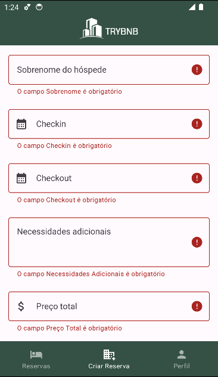

<br /></details>

<details><summary><strong>👩‍💻 Regras de implementação</strong></summary>

### Regras de negócio

- Se o campo de `Nome do hóspede` estiver vazio, ele deve exibir a mensagem de erro com o texto `O campo Nome é obrigatório`
- Se o campo de `Sobrenome` estiver vazio, ele deve exibir a mensagem de erro com o texto `O campo Sobrenome é obrigatório`
- Se o campo de `Checkin` estiver vazio, ele deve exibir a mensagem de erro com o texto `O campo Checkin é obrigatório`
- Se o campo de `Checkout` estiver vazio, ele deve exibir a mensagem de erro com o texto `O campo Checkout é obrigatório`
- Se o campo de `Necessidades Adicionais` estiver vazio, ele deve exibir a mensagem de erro com o texto `O campo Necessidades Adicionais é obrigatório`
- Se o campo de `Preço Total` estiver vazio, ele deve exibir a mensagem de erro com o texto `O campo Preço Total é obrigatório`
- A validação será realizada após o clique no botão Criar Reserva.

### O que será testado?

- Que ao clicar no menu Criar Reserva, o fragmento será carregado
- Que os campos de Nome, Sobrenome, Checkin, Checkout, Necessidades Adicionais e Preço Total são deixados em branco, eles devem exibir suas respectivas mensagens de erro

<br/></details>

## `11 - Realizar requisição ao endpoint POST /booking usando Retrofit`

Você deve criar uma requisição à [API](https://restful-booker.herokuapp.com/apidoc/index.html#api-Booking-CreateBooking) na rota POST /booking, enviando as informações inseridas na tela de criação de reserva

<details><summary><strong>👩‍💻 Regras de implementação</strong></summary>

### Onde desenvolver

O objetivo deste requisito é implementar ou criar uma interface para realizar requisições à API, utilizando-a em conjunto com o Retrofit.

Para que este requisito funcione corretamente, você precisará usar a classe `ApildlingResource` dentro de todas as suas Coroutines, como no exemplo a seguir:

``` Kotlin
CoroutineScope(Main).launch {
    try {
        // ADICIONAR ESSA LINHA
        ApiIdlingResource.increment()

        //...
        // Seu Codigo das Rotinas
        // ...

        // ADICIONAR ESSA LINHA
        ApiIdlingResource.decrement()
    } catch (e: HttpException) {
        // ADICIONAR ESSA LINHA
        ApiIdlingResource.decrement()

        //...
        // Seu Codigo de erro de HttpException
        // ...
    } catch (e: IOException) {
        // ADICIONAR ESSA LINHA
        ApiIdlingResource.decrement()

        //...
        // Seu Codigo de erro de IOException
        // ...
    }
}
```

### O que será testado?

- Ao clicar no menu `Criar Reserva`, o fragmento será carregado
- Será digitado no campo nome o texto `Italo`
- Será digitado no campo sobrenome o texto `Moura`
- Será digitado no campo checkin o texto `10/11/2023`
- Será digitado no campo checkout o texto `19/11/2023`
- Será digitado no campo necessidades adicionais o texto `Central de ar`
- Será digitado no campo preço total o texto `223`
- A requisição será realizada ao clicar no botão `Criar Reserva`
- Após uma requisição bem-sucedida, a mensagem `Reserva feita com sucesso!` aparecerá na tela

<br/></details>

---

<details>
<summary><strong>🗣 Nos dê feedbacks sobre o projeto!</strong></summary><br />

Ao finalizar e submeter o projeto, não se esqueça de avaliar sua experiência preenchendo o formulário.
**Leva menos de 3 minutos!**

[Formulário de avaliação do projeto](https://be-trybe.typeform.com/to/ZTeR4IbH#cohort_hidden=CH29-ANDROID&template=betrybe/android-0x-projeto-trybnb)

<br /></details>

<details>
<summary><strong>🗂 Compartilhe seu portfólio!</strong></summary><br />

Você sabia que o LinkedIn é a principal rede social profissional e compartilhar o seu aprendizado lá é muito importante para quem deseja construir uma carreira de sucesso? Compartilhe esse projeto no seu LinkedIn, marque o perfil da Trybe (@trybe) e mostre para a sua rede toda a sua evolução.

<br /></details>
